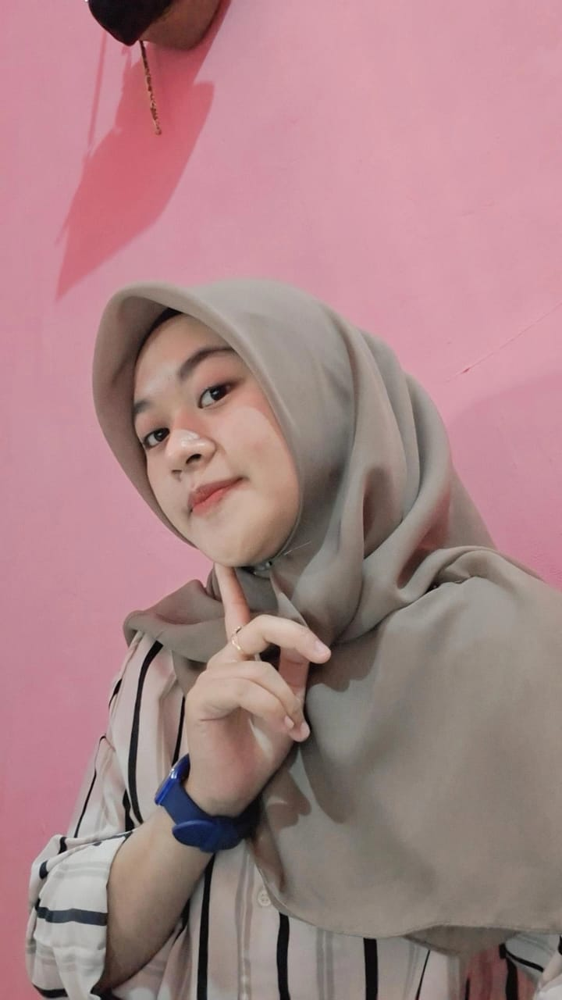

<!-- Slide 2: Galeri -->

  <section class="section">
    <h2>📷 My Gallery 🖼️</h2>
    

      
      
      
      
      
      
    

  </section>

Analisis Kode:
Blok ini menambahkan slide kedua di portofolio, khusus untuk menampilkan galeri foto. Slide dibungkus dengan 
 agar bisa diakses langsung dari sidebar menggunakan anchor link #gallery.

Di dalamnya, <section class="section"> memberi style konsisten dengan slide lain: padding, background gradient semi-transparan, border-radius, shadow, dan animasi fade-in. Judul <h2> menggunakan emoji kamera dan sticker animasi untuk memberi efek visual interaktif yang menarik perhatian pengguna.

Selanjutnya 
 berfungsi sebagai container grid untuk semua gambar. Grid membuat gambar tersusun rapi, responsif menyesuaikan ukuran layar. Tag  masing-masing memiliki src (lokasi file) dan alt (deskripsi gambar), yang penting untuk aksesibilitas dan SEO. Dengan struktur ini, galeri terlihat rapi dan mudah di-navigasi.
/* Gallery */
.gallery {
  display: grid;
  grid-template-columns: repeat(auto-fit, minmax(220px, 1fr));
  gap: 20px;
  margin-top: 20px;
}
.gallery img {
  width: 100%;
  border-radius: 12px;
  border: 3px solid #fff;
  box-shadow: 0 5px 15px rgba(0,0,0,0.3);
  opacity: 0.8;
  transition: transform 0.3s, opacity 0.3s;
}
.gallery img:hover {
  transform: scale(1.05);
  opacity: 1;
}
Analisis kode:
CSS ini mengatur layout dan interaktivitas galeri. Container .gallery menggunakan CSS Grid, di mana grid-template-columns: repeat(auto-fit, minmax(220px, 1fr)) memastikan jumlah kolom otomatis menyesuaikan lebar layar, sehingga tampilan tetap rapi di berbagai perangkat. gap: 20px memberi jarak antar gambar agar tidak saling menempel, dan margin-top: 20px memberi ruang dari judul section.

Setiap gambar .gallery img diatur agar width: 100%, memanfaatkan lebar kolom. Border putih, border-radius, dan shadow memberi kesan elegan dan menonjol dari background. opacity: 0.8 membuat efek awal sedikit transparan, lalu saat hover, gambar membesar sedikit (transform: scale(1.05)) dan opacity menjadi penuh (opacity: 1). Ini memberikan pengalaman visual dinamis, membuat galeri terlihat hidup saat pengguna berinteraksi.
